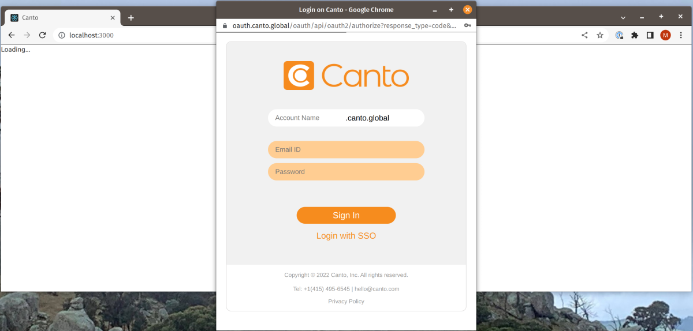

# Canto React Plugin

Using Typescript.

## Running

To run in development:

Set APP_ID and APP_SECRET in `server/.env`.

The APP_ID and APP_SECRET are the API Keys obtained from the Canto UI under 'Settings'
(top-right menu when click on User Profile Avatar) > 'Configuration Options' > 'API' (last
item in side menu) > 'API Keys'. Select existing or 'Create API Key'.

Set APP_ID in `client/.env`.

Make sure node modules are installed in each of `client` and `server`.

    cd client
    npm i
    cd ../server
    npm i
    cd ..

In one terminal window/tab, run the server:

    cd server
    npm start

In another terminal window/tab, run the client:

    cd client
    npm start

Open a browser window to http://localhost:3000

## Server

The Server uses Node and Fastify. The server is mainly acting as a reverse proxy
to avoid CORS errors.

The two main functions are:

1. Getting a token - `server/routes/token/index.js`
2. Proxying client requests to the Canto API - `server/plugins/http-proxy.js`

## Client

The client is a React application using the Create React App (CRA) template.

